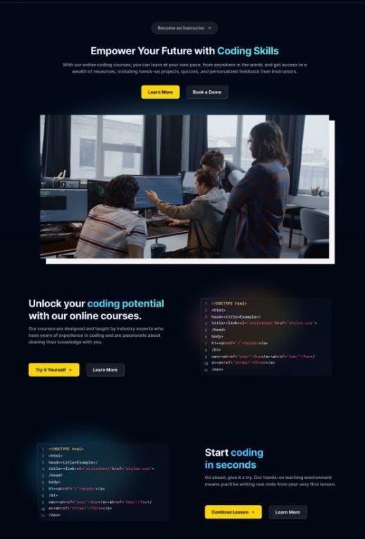

# SkillMaster Online Education Platform (MERN App)

**Website Link:** [SkillMaster EdTech Platform](https://mega-mern-edtech.vercel.app/)

**EdTech Platform Overview:**
SkillMaster is a fully functional EdTech platform designed to empower users to create, consume, and rate educational content. Leveraging the MERN stack, the platform incorporates ReactJS, NodeJS, MongoDB, and ExpressJS.

## Table of Contents

- [Introduction](#introduction)
- [System Architecture](#system-architecture)
  - [Front-end](#front-end)
  - [Back-end](#back-end)
  - [Database](#database)
  - [Architecture Diagram](#architecture-diagram)
- [API Design](#api-design)
- [Installation](#installation)
- [Configuration](#configuration)
- [Usage](#usage)

## Project Description

SkillMaster is a versatile and intuitive ed-tech platform that enables users to create, consume, and rate educational content. The platform is built using the MERN stack, providing a seamless learning experience for students and a platform for instructors to showcase their expertise.

### Introduction

SkillMaster aims to provide a seamless and interactive learning experience for students, making education more accessible and engaging. Additionally, the platform serves as a platform for instructors to connect with learners globally.

### System Architecture

The SkillMaster ed-tech platform consists of three main components: the front end, the back end, and the database. The platform follows a client-server architecture.

#### Front-end

The front-end is built using ReactJS, allowing for dynamic and responsive user interfaces. It communicates with the back-end using RESTful API calls.

##### Front End Pages

For Students:
- Homepage
- **Homepage:** A brief introduction to the platform with links to the course list and user details.
- 
- **Course List:** A list of all the courses available on the platform, along with their descriptions and ratings.
- **Wishlist:** Displays all the courses that a student has added to their wishlist.
- **Cart Checkout:** Allows the user to complete course purchases.
- **Course Content:** Presents the course content for a particular course, including videos and related material.
- **User Details:** Provides details about the student's account, including their name, email, and other relevant information.
- **User Edit Details:** Allows students to edit their account details.

For Instructors:
- **Dashboard:** Offers an overview of the instructor's courses, along with ratings and feedback for each course.
- **Insights:** Provides detailed insights into the instructor's courses, including the number of views, clicks, and other relevant metrics.
- **Course Management Pages:** Enables instructors to create, update, and delete courses, as well as manage course content and pricing.
- **View and Edit Profile Details:** Allows instructors to view and edit their account details.

##### Front-end Tools and Libraries

Frameworks and libraries include ReactJS, CSS, Tailwind for styling, and Redux for state management.

#### Back-end

The back-end is built using NodeJS and ExpressJS, providing APIs for the front-end to consume. It handles user authentication, course management, payment integration, cloud-based media management, and markdown formatting.

##### Back-end Features

- **User Authentication and Authorization:** Students and instructors can sign up and log in to the platform using their email addresses and passwords. The platform also supports OTP (One-Time Password) verification and forgot password functionality for added security.
- **Course Management:** Instructors can create, read, update, and delete courses, as well as manage course content and media. Students can view and rate courses.
- **Payment Integration:** Students will purchase and enroll in courses by completing the checkout flow, followed by Razorpay integration for payment handling.
- **Cloud-based Media Management:** SkillMaster uses Cloudinary, a cloud-based media management service, to store and manage all media content, including images, videos, and documents.
- **Markdown Formatting:** Course content in document format is stored in Markdown format, allowing for easier display and rendering on the front-end.
##### Back-end Frameworks, Libraries, and Tools

Node.js, Express.js, MongoDB, JWT, Bcrypt, and Mongoose.

##### Data Models and Database Schema

Data models include Student Schema, Instructor Schema, and Course Schema.

### Database

The database is built using MongoDB, providing a flexible and scalable data storage solution.

### Architecture Diagram

## API Design

The SkillMaster platform's API is designed following the REST architectural style. It is implemented using Node.js and Express.js, using JSON for data exchange and standard HTTP request methods.

For detailed API documentation and endpoints, refer to the [API Documentation](/api-docs).

## Installation

1. Clone the repository: `git clone https://github.com/bezalel-7/MEGA-MERN-EDTECH.git`
2. Navigate to the project directory: `cd final_test `
3. Install dependencies: `npm install`
4. Install dependencies for server: `cd final_test/server/ && npm install`

## Configuration

1. Set up a MongoDB database and obtain the connection URL.
2. Create a `.env` file in the root directory with the following environment variables:
3. MONGODB_URI=<your-mongodb-connection-url>
  JWT_SECRET=<your-jwt-secret-key>
  
## Usage

1. Open a new terminal and navigate to the directory: `cd final_test`
2. Start the React development server: `npm run dev`

Access the application in your browser at `http://localhost:3000`.

In conclusion, SkillMaster offers a comprehensive learning experience for students and a platform for instructors to showcase their expertise. The technical details outlined above provide insights into the platform's architecture, features, and functionalities.

